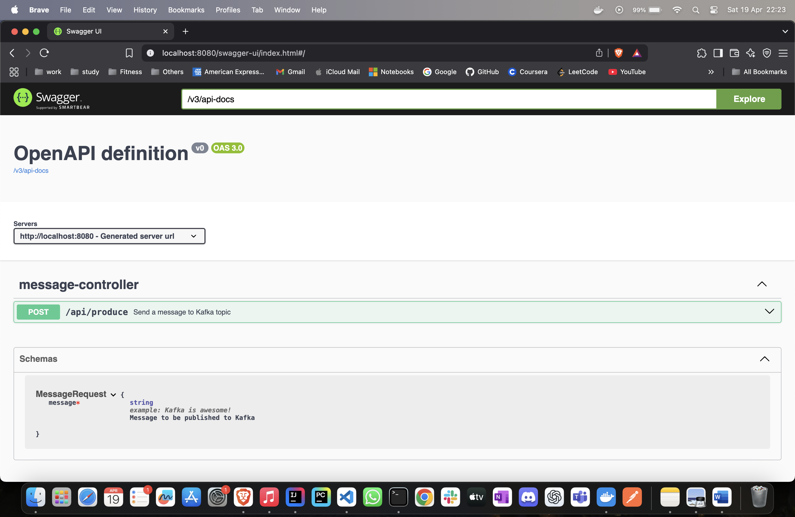
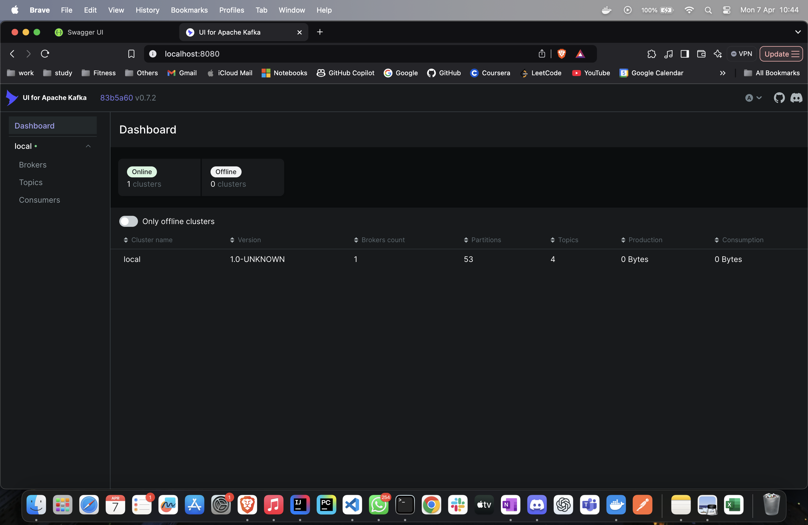

# Spring Boot With Kafka (KRaft Mode)

This is a simple Kafka-based application using Spring Boot that allows sending and consuming messages via a REST API. It uses Apache Kafka running in KRaft (Kafka Raft metadata mode) using the Bitnami Docker image.

---

## About KRaft (Kafka Raft Metadata Mode)

KRaft (Kafka Raft Metadata mode) is a newer architecture introduced in Apache Kafka to eliminate the need for ZooKeeper. It offers a simplified and more scalable way to manage metadata within the Kafka cluster.

### Key Benefits of KRaft

- No ZooKeeper dependency
- Built-in Raft consensus for metadata consistency
- Simpler deployment and management
- Better support for scaling controllers

### KRaft vs ZooKeeper Architecture

The following diagram compares the traditional ZooKeeper-based Kafka setup with the newer KRaft-based setup:


> Source: [Confluent Developer – Learn KRaft](https://developer.confluent.io/learn/kraft/)

---

## Features

- Kafka setup using Bitnami Kafka Docker image (no ZooKeeper, KRaft mode)
- Spring Boot Kafka producer and consumer
- REST API endpoint to produce messages
- Kafka listener to consume messages
- Swagger/OpenAPI documentation
- Kafka UI to monitor topics and messages
- Postman collection available for quick API testing

---

## Tech Stack

- Java 21
- Spring Boot 3.4.4
- Spring Kafka
- Apache Kafka 3.8.1
- Docker (Bitnami Kafka image)
- Maven

---

## Project Structure

```
src/
├── controller/MessageController.java
├── dto/MessageRequest.java
├── producer/KafkaProducerService.java
├── consumer/KafkaConsumerService.java
└── resources/application.properties

docker/
└── docker-compose.yml

docs/
├── swagger-ui-screenshot.png
└── kafka-ui-screenshot.png

root/
└── kafka-postman-collection.json
```

---

## Step 1: Start Kafka with Docker Compose (KRaft Mode)

From the project root, run the appropriate command based on your Docker version:

For Docker versions **below 20**:

```bash
docker-compose -f docker/docker-compose.yml up -d
```

For Docker versions 20 and above (uses new syntax):

```
docker compose -f docker/docker-compose.yml up -d
```

To stop Kafka:

```bash
docker compose -f docker/docker-compose.yml down
```

To view logs:

```bash
docker compose -f docker/docker-compose.yml logs -f
```

To enter the Kafka container:

```bash
docker exec -it kafka-container bash
```

---

## Step 2: Optional – Create Kafka Topic Manually

Kafka topics are auto-created if `KAFKA_CFG_AUTO_CREATE_TOPICS_ENABLE=true`. If needed, manually create:

```bash
docker exec -it kafka-container bash

kafka-topics.sh --bootstrap-server localhost:9092 \
  --create --topic message-topic \
  --partitions 1 --replication-factor 1
```

If the topic already exists, the error can be ignored.

---

## Step 3: Run the Spring Boot Application

Check if port 8080 is free:

```bash
lsof -i :8080
```

If it is occupied, kill the process:

```bash
kill -9 <pid>
```

Then run the app:

```bash
mvn spring-boot:run
```

---

## Step 4: Send a Message (via cURL)

```bash
curl -X POST http://localhost:8080/api/produce \
  -H "Content-Type: application/json" \
  -d '{"message": "Kafka is awesome!"}'
```

---

## Step 5: Send a Message (via Postman)

You can import the `kafka-postman-collection.json` file from the project root into Postman.

Send a `POST` request to:

```
http://localhost:9200/api/produce
```

Body (JSON):

```json
{
  "message": "Kafka is awesome!"
}
```

---

## Output Logs

**Producer logs:**

```
Producing message to Kafka: Kafka is awesome!
Message sent to topic: message-topic
```

**Consumer logs:**

```
Received message from Kafka: Kafka is awesome!
```

---

## Swagger UI

You can access the API documentation at:

```
http://localhost:8080/swagger-ui/index.html
```


This Swagger page includes:

- **POST /api/produce**  
  - **Request Body Example:**
    ```json
    {
      "message": "Kafka is awesome!"
    }
    ```
  - **Expected Response:**
    ```json
    {
      "statusCode": 201,
      "info": "Message sent to Kafka successfully"
    }
    ```

**Screenshot:**



---

## Kafka UI

Kafka UI dashboard is accessible at:

```
http://localhost:8080/
```

**Screenshot:**



---

## Status

- Kafka is running in KRaft mode via Docker Compose. 
- Spring Boot successfully produces and consumes messages using Kafka.
- Postman and Swagger are integrated for easy testing and API documentation.
- Kafka UI helps visualize topics and messages in real time.
- All review comments from both Yatin and Mahi Sir have been incorporated.
- The project is now finalized and ready for next enhancements.

---

