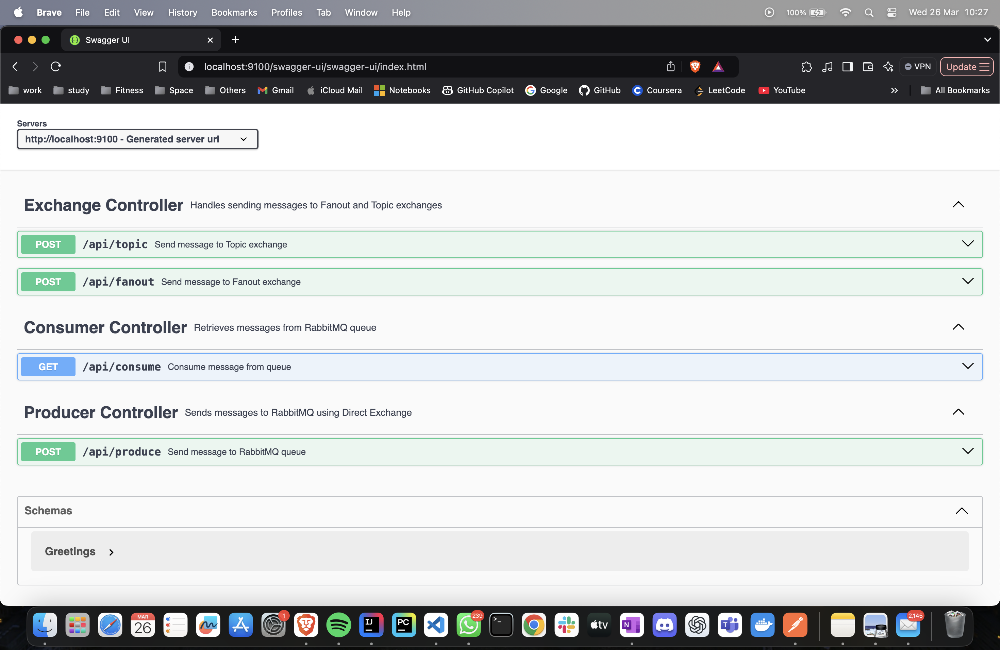

# Spring Boot RabbitMQ Integration

This project demonstrates how to integrate RabbitMQ with a Spring Boot application using different exchange types:
- Direct Exchange
- Fanout Exchange
- Topic Exchange

---

## Tools Required

- Java 21
- Maven 3.9+
- Docker (with Docker Compose)
- IntelliJ IDEA (or any IDE)
- Postman or Curl
- Internet access to pull RabbitMQ Docker image

For setup instructions on Mac or Windows, see:
- [Installing Rabbit MQ - MacOS](https://scribehow.com/shared/Installing_Rabbit_MQ__MacOS__Sr5zdWkDTmywQAU0zb1BZw)
- [Installing Rabbit MQ - Windows](https://scribehow.com/shared/Installing_Rabbit_MQ__Windows__FSQhxP9dRSu-yEzc-D9Hpw)

---

## Setup and Running the Application

### 1. Start RabbitMQ in Docker
If RabbitMQ is already installed, start it:
Before Docker v20
```
docker-compose -f docker/docker-compose.yml up -d
```
If you're using Docker v20.10+, docker compose (without a dash) is the new way.
```
docker compose -f docker/docker-compose.yml up -d
```

If RabbitMQ is not installed, run this command to create and start a new RabbitMQ container:
```
docker run -d --name rabbitmq -p 5672:5672 -p 15672:15672 rabbitmq:3-management
```

### 2. Verify RabbitMQ Is Running
Visit:  
http://localhost:15672

Login credentials:
- Username: guest
- Password: guest

---

## Build and Run the Spring Boot Application

### Option 1: Using Terminal

#### 1. Clean and Reinstall Dependencies
```
mvn clean install
```

#### 2. Start the Application
```
mvn spring-boot:run
```

#### 3. Check and Kill Port if Blocked
```
lsof -i :9100
kill -9 <PID>
```

---

### Option 2: Using IntelliJ IDEA

1. Open the project in IntelliJ
2. Right-click `SpringMessageBrokerApplication.java` and select `Run`
3. Ensure port 9100 is not blocked

---

## API Endpoints (Using Postman or Swagger UI)

### 1. Send Message to Direct Exchange

**Endpoint:** `POST /api/produce` - ProductController

**Payload:**
```json
{
  "message": "Hello, RabbitMQ!"
}
```

**Response:**
```json
{
  "statusCode": 202,
  "info": "Acknowledged"
}
```

---

### 2. Receive a Message from the Queue

**Endpoint:** `GET /api/consume`

**Response:**
```
Hello, RabbitMQ!
```

---

### 3. Send Message to Fanout Exchange

**Endpoint:** `POST /api/fanout`

**Payload:**
```json
{
  "message": "Hello, RabbitMQ!"
}
```

**Response:**
```json
{
  "info": "Sent to fanout exchange"
}
```

---

### 4. Send Message to Topic Exchange

**Endpoint:** `POST /api/topic?key=user.created`

**Payload:**
```json
{
  "message": "Hello, RabbitMQ!"
}
```

**Response:**
```json
{
  "info": "Sent to topic exchange with routing key: user.created"
}
```

---

## API Documentation (Swagger UI)

Swagger UI is integrated and provides an interactive way to view and test all API endpoints.

- Visit: [http://localhost:9100/swagger-ui/index.html](http://localhost:9100/swagger-ui/index.html)

### Screenshot:



---

## Postman Collection

See `SpringMessageBrokerAPI.postman_collection.json` for ready-to-use API tests.

---

## Highlights

- Direct Exchange-based messaging
- Fanout Exchange broadcasting
- Topic Exchange pattern-based routing
- All exchanges configured in `RabbitMQConfig.java`

---

